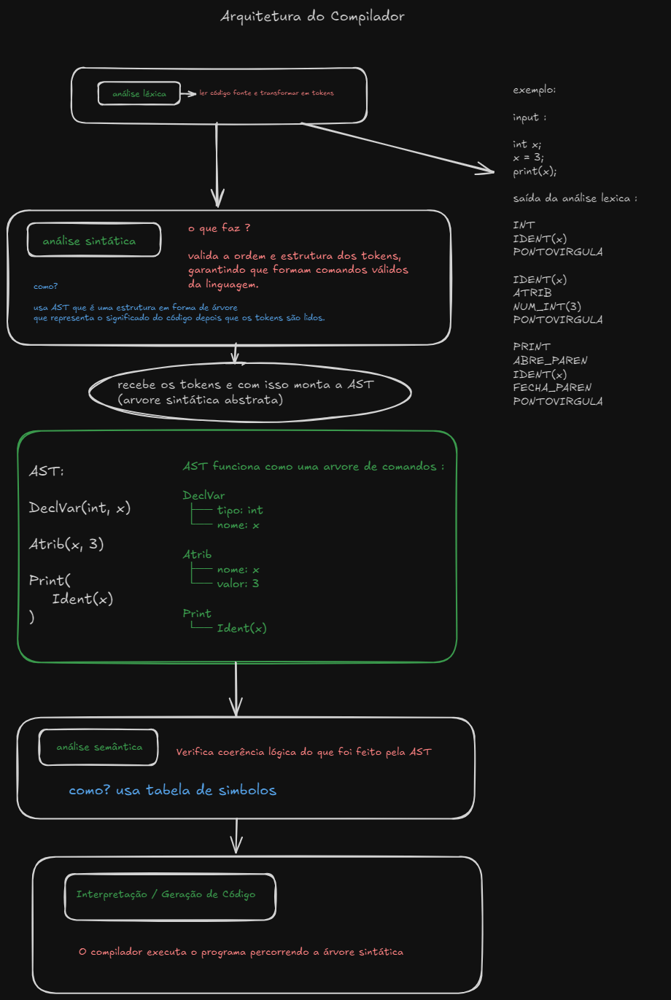

# Mini Compilador A3 - Teoria da Computação e Compiladores

---

- Analisador Léxico -> Guilherme
- Analisador Sintático -> Yasmin e Thiago
- Analisador Semântico -> Nicolas e Alex
- Geração de código

## 1. Requisitos do Projeto 

### Especificações da Aplicação

O projeto deve desenvolver um mini compilador para uma **linguagem própria**, criada exclusivamente para este trabalho e **inspirada em Java**.

O compilador deve contemplar:

* **a) O funcionamento de cada etapa de um compilador:**
    * Análise léxica
    * Análise sintática
    * Análise semântica
    * Geração de código
* **b) Implementar um analisador léxico e sintático funcional.**
* **c) Traduzir expressões simples** para uma linguagem intermediária ou código executável.
* **d) Desenvolver e apresentar a documentação dos testes** do programa.

### Especificações da Linguagem Própria

A linguagem criada deve suportar:

* **I. Declaração de variáveis** (inteiros e reais)
* **II. Atribuições**
* **III. Estruturas sequenciais, condicionais e de repetição**
* **IV. Operações aritméticas e lógicas básicas**
* **V. Comandos de entrada e saída**

---

## 2. Especificações da Linguagem 

A linguagem desenvolvida neste projeto foi criada por nós e é **inspirada na sintaxe e estrutura do Java**, porém simplificada.

### Características principais:

* **Tipos de Dados:**  
  `int`, `real`, `string`

* **Palavras-Chave:**  
  `int`, `real`, `string` (declaração)  
  `read`, `print` (entrada e saída)  
  `if`, `else` (condicional)  
  `while` (repetição)  
  `func` (funções)  
  `main` (ponto de entrada)

* **Operadores e Símbolos:**  
  `=` (atribuição)  
  `+`, `-`, `*`, `/` (aritméticos)  
  `>`, `<`, `==`, `!=`, `&&`, `||` (lógicos/relacionais)  
  `(` , `)` , `{` , `}` (delimitadores)  
  `;` (fim de instrução)

### Exemplo da sintaxe da linguagem:

```plaintext
int x = 10;
real y = 2.5;

if (x > 5) {
    print("Valor maior que 5");
} else {
    print("Valor menor ou igual a 5");
}
````
---

### Arquitetura: 



