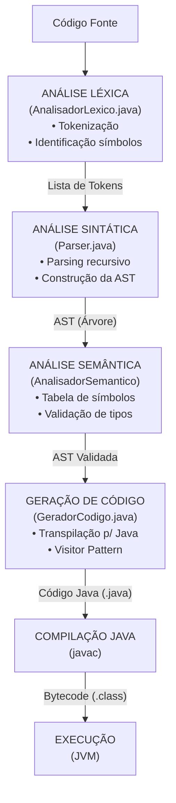

# Mini Compilador A3 - Teoria da Computação e Compiladores

---

- Analisador Léxico -> Guilherme
- Analisador Sintático -> Yasmin e Thiago
- Analisador Semântico -> Nicolas e Alex
- Geração de código

## 1. Requisitos do Projeto 

### Especificações da Aplicação

O projeto deve desenvolver um mini compilador para uma **linguagem própria**, criada exclusivamente para este trabalho e **inspirada em Java**.

O compilador deve contemplar:

* **a) O funcionamento de cada etapa de um compilador:**
    * Análise léxica
    * Análise sintática
    * Análise semântica
    * Geração de código
* **b) Implementar um analisador léxico e sintático funcional.**
* **c) Traduzir expressões simples** para uma linguagem intermediária ou código executável.
* **d) Desenvolver e apresentar a documentação dos testes** do programa.

### Especificações da Linguagem Própria

A linguagem criada deve suportar:

* **I. Declaração de variáveis** (inteiros e reais)
* **II. Atribuições**
* **III. Estruturas sequenciais, condicionais e de repetição**
* **IV. Operações aritméticas e lógicas básicas**
* **V. Comandos de entrada e saída**

---

## 2. Testes e Exemplos

### Testes Automatizados

O projeto inclui testes automatizados para validar o funcionamento do compilador. Os testes estão localizados em `src/test/resources/`.

#### Exemplo de Teste (exemplo.txt)
```txt
print("=== Calculadora de IMC ===");
print("Digite seu peso em kg:");
real peso;
read(peso);

print("Digite sua altura em metros:");
real altura;
read(altura);

// Cálculo do IMC
real imc = peso / (altura * altura);

print("=== Resultado ===");
print("Seu IMC calculado:");
print(imc);

// Estruturas condicionais aninhadas
if (imc < 18.5) {
    print("Abaixo do peso");
} else {
    if (imc < 25.0) {
        print("Peso normal");
    } else {
        if (imc < 30.0) {
            print("Sobrepeso");
        } else {
            print("Obesidade");
        }
    }
}

// Estrutura de repetição
print("=== Contagem ===");
int contador = 1;
while (contador <= 5) {
    print("Contagem: ", contador);
    contador = contador + 1;
}
```

### Como Executar os Testes

1. **Executando um arquivo de teste específico:**
   ```bash
   mvn exec:java -Dexec.mainClass="org.example.Main" -Dexec.args="caminho/para/teste.kl"
   ```

2. **Executando o exemplo padrão:**
   ```bash
   mvn exec:java -Dexec.mainClass="org.example.Main"
   ```
   Isso executará o arquivo `src/test/resources/exemplo.txt` por padrão.

### Saída Esperada

Ao executar o exemplo da calculadora de IMC, o programa irá:
1. Solicitar o peso em kg
2. Solicitar a altura em metros
3. Calcular e exibir o IMC
4. Classificar o IMC
5. Mostrar uma contagem de 1 a 5

### Estrutura dos Testes

- `src/test/resources/` - Contém os arquivos de teste
  - `exemplo.txt` - Exemplo completo demonstrando os recursos da linguagem
  - `variaveis.kl` - Testes de declaração e atribuição de variáveis
  - `condicionais.kl` - Testes de estruturas condicionais
  - `repeticoes.kl` - Testes de estruturas de repetição

### Verificação de Erros

O compilador inclui tratamento de erros para:
- Caracteres inválidos
- Tipos incompatíveis
- Variáveis não declaradas
- Erros de sintaxe

## 3. Especificações da Linguagem 

A linguagem desenvolvida neste projeto foi criada por nós e é **inspirada na sintaxe do Java e do Python**, porém simplificada.

### Características principais:

* **Tipos de Dados:**  
  `int`, `real`, `string`

* **Palavras-Chave:**  
  `int`, `real`, `string` (declaração)  
  `read`, `print` (entrada e saída)  
  `if`, `else` (condicional)  
  `while` (repetição)  
  `func` (funções)  
  `main` (ponto de entrada)

* **Operadores e Símbolos:**  
  `=` (atribuição)  
  `+`, `-`, `*`, `/` (aritméticos)  
  `>`, `<`, `==`, `!=`, `&&`, `||` (lógicos/relacionais)  
  `(` , `)` , `{` , `}` (delimitadores)  
  `;` (fim de instrução)

### Exemplo da sintaxe da linguagem:

```plaintext
int x = 10;
real y = 2.5;

if (x > 5) {
    print("Valor maior que 5");
} else {
    print("Valor menor ou igual a 5");
}
````
---

### Arquitetura: 


## 3. Fluxo da Geração de Código (Transpilação)

Para cumprir o requisito de gerar **código executável**, optamos pela estratégia de **Transpilação** (*Source-to-Source*). Em vez de criar uma máquina virtual complexa, nosso compilador traduz a linguagem própria diretamente para **código Java válido**.

### Objetivo
Transformar a Árvore Sintática Abstrata (AST), já validada semanticamente, em um arquivo de código-fonte Java (`.java`) que pode ser compilado e executado nativamente pela JVM.

### Componente Principal

* **`GeradorCodigo` (O Tradutor):**
    * Assim como nas etapas anteriores, utiliza o padrão **Visitor** para percorrer a AST.
    * Em vez de validar regras, ele **concatena Strings** para montar a estrutura de um arquivo Java.
    * Gerencia a inclusão de bibliotecas necessárias (como `java.util.Scanner` para entrada de dados).

### Regras de Tradução (Mapeamento)

O gerador realiza a conversão direta dos comandos da nossa linguagem para a sintaxe do Java:

1.  **Estrutura Básica:**
    * Envolve todo o código gerado em uma classe padrão `public class ProgramaCompilado` e um método `main`.

2.  **Mapeamento de Tipos:**
    * Nossa linguagem `real` → Java `double`
    * Nossa linguagem `string` → Java `String`
    * Nossa linguagem `int` → Java `int`

3.  **Comandos de E/S:**
    * `print(x)` → É traduzido para `System.out.println(x);`.
    * `read(x)` → Instancia um objeto `Scanner` e traduz para `x = scanner.nextInt();` (ou equivalente).

### Resultado Final

Ao final da execução do pipeline, o compilador:
1.  Gera uma String contendo todo o código Java traduzido.
2.  Salva fisicamente um arquivo chamado **`ProgramaCompilado.java`** na raiz do projeto.
3.  Este arquivo fica pronto para ser compilado por qualquer JDK padrão.

---

## 4. Execução e Automação

O arquivo `Main` foi configurado para automatizar todo o processo de compilação e execução, abstraindo a complexidade do usuário final.

### Fluxo Automático (`Main.java`):

1.  **Léxico & Sintático:** O código fonte é lido e transformado em uma AST.
2.  **Semântico:** A AST é validada (regras de tipos e escopo).
3.  **Geração:** O transpilador cria o arquivo físico `ProgramaCompilado.java`.
4.  **Compilação Dinâmica:** O `Main` invoca o compilador do sistema (`javac`) programaticamente através da biblioteca `javax.tools`.
5.  **Execução:** Se a compilação for bem-sucedida, o programa compilado é executado automaticamente em um processo separado e a saída é exibida no terminal.

---

# Arquitetura Final 


