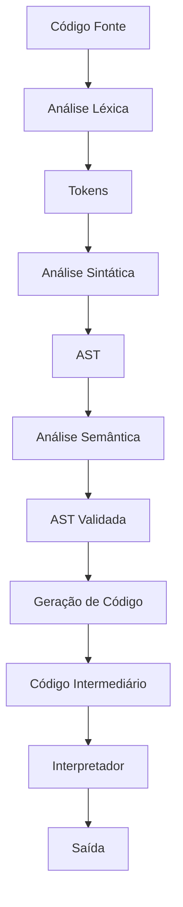

# Mini Compilador A3 - Teoria da Computação e Compiladores

---

- Analisador Léxico -> Guilherme
- Analisador Sintático -> Yasmin e Thiago
- Analisador Semântico -> Nicolas e Alex
- Geração de código

## 1. Requisitos do Projeto 

### Especificações da Aplicação

O projeto deve desenvolver um mini compilador para uma **linguagem própria**, criada exclusivamente para este trabalho e **inspirada em Java**.

O compilador deve contemplar:

* **a) O funcionamento de cada etapa de um compilador:**
    * Análise léxica
    * Análise sintática
    * Análise semântica
    * Geração de código
* **b) Implementar um analisador léxico e sintático funcional.**
* **c) Traduzir expressões simples** para uma linguagem intermediária ou código executável.
* **d) Desenvolver e apresentar a documentação dos testes** do programa.

### Especificações da Linguagem Própria

A linguagem criada deve suportar:

* **I. Declaração de variáveis** (inteiros e reais)
* **II. Atribuições**
* **III. Estruturas sequenciais, condicionais e de repetição**
* **IV. Operações aritméticas e lógicas básicas**
* **V. Comandos de entrada e saída**

---

## 2. Especificações da Linguagem 

A linguagem desenvolvida neste projeto foi criada por nós e é **inspirada na sintaxe e estrutura do Java**, porém simplificada.

### Características principais:

* **Tipos de Dados:**  
  `int`, `real`, `string`

* **Palavras-Chave:**  
  `int`, `real`, `string` (declaração)  
  `read`, `print` (entrada e saída)  
  `if`, `else` (condicional)  
  `while` (repetição)  
  `func` (funções)  
  `main` (ponto de entrada)

* **Operadores e Símbolos:**  
  `=` (atribuição)  
  `+`, `-`, `*`, `/` (aritméticos)  
  `>`, `<`, `==`, `!=`, `&&`, `||` (lógicos/relacionais)  
  `(` , `)` , `{` , `}` (delimitadores)  
  `;` (fim de instrução)

### Exemplo da sintaxe da linguagem:

```plaintext
int x = 10;
real y = 2.5;

if (x > 5) {
    print("Valor maior que 5");
} else {
    print("Valor menor ou igual a 5");
}
````
---

### Arquitetura: 


## 3. Fluxo da Análise Sintática

### Pipeline léxico → sintático
1. **`AnalisadorLexico`** lê o código-fonte e produz uma lista ordenada de tokens. Cada token carrega tipo (`TipoToken`) e lexema original.
2. **`Parser`** consome essa lista e aplica uma gramática LL recursiva, construindo uma **AST (Abstract Syntax Tree)** composta pelos nós `Stmt` (declarações/comandos) e `Expr` (expressões).
3. **`AstPrinter`** visita a AST e gera uma representação textual pra debug.

### Estrutura do Parser
- Entrada principal: `parsePrograma()` → retorna `List<Stmt>` onde cada elemento representa uma declaração de alto nível.
- Gramática implementada:
  - Declarações: `varDecl`, `statement` (print, if/else, while, blocos, expressão terminada por `;`).
  - Expressões: `assignment → logicOr → logicAnd → equality → comparison → term → factor → unary → primary` com as precedências clássicas (`=` mais fraco, `* / %` mais forte).
- Validação de operadores por tipo **e** lexema (helper `matchOp`) evita consumir tokens incorretos.
- Erros sintáticos lançam `RuntimeException` com mensagens descritivas (ex.: parêntese não fechado, atribuição inválida).

### AST (`Stmt` e `Expr`)
- `Stmt.Var`, `Stmt.Print`, `Stmt.If`, `Stmt.While`, `Stmt.Block`, `Stmt.ExprStmt` mapeiam diretamente cada construção suportada.
- `Expr.Literal`, `Expr.Variable`, `Expr.Grouping`, `Expr.Unary`, `Expr.Binary`, `Expr.Logical` descrevem árvores de expressão.
- Ambos usam o padrão Visitor para que futuras fases (intérprete, geração de código) percorram a AST de forma tipada.

### Execução e logs
- `Main` aceita dois modos:
  1. `java -cp target/classes org.example.Main <arquivo>` para processar um arquivo.
  2. `java -cp target/classes org.example.Main` para entrar no modo interativo (finalize com `EOF`).
- Durante a execução são exibidos logs `[INFO]` mostrando tokens, resumo por tipo, início/fim do parsing e a AST resultante (`[n] ...`).

### Testes unitários
- `mvn test` executa:
  - `AnalisadorLexicoTest`: garante que tokens são gerados corretamente (inline + arquivo de exemplo).
  - `ParserTest`: cobre declarações, blocos, `if/else`, `while`, precedência aritmética/lógica, erros sintáticos e a saída textual da AST.
- Esses testes exercitam o pipeline completo (lexer+parser+AST) e servem de regressão para novas features.


---
## Fluxo atual: 



---

## Componentes Principais

### 1. Analisador Léxico
* **Arquivo:** `AnalisadorLexico.java`
* **Responsabilidades:**
    * Tokenização do código fonte.
    * Reconhecimento de palavras-chave e símbolos.
    * Geração de tokens.

### 2. Analisador Sintático
* **Arquivo:** `Parser.java`
* **Responsabilidades:**
    * Parser descendente recursivo.
    * Construção da AST (Abstract Syntax Tree).
    * Validação da estrutura gramatical.

### 3. Analisador Semântico
* **Arquivo:** `AnalisadorSemantico.java`
* **Responsabilidades:**
    * Verificação de tipos.
    * Gerenciamento da Tabela de Símbolos.
    * Validação de escopo.


### 4. Gerador de Código
* **Arquivo:** `GeradorDeCodigo.java`
* **Responsabilidades:**
    * Geração de código intermediário (IC).
    * Criação de instruções de três endereços.
    * Controle de fluxo com labels.

### 5. Interpretadores

**Interpretador IC**
* **Arquivo:** `InterpretadorIC.java`
* **Funcionalidade:**
    * Executa o código intermediário gerado.
    * Gerencia a pilha de execução.
    * Processa estruturas de controle.

**Interpretador de Expressões**
* **Funcionalidade:**
    * Executa expressões aritméticas diretamente da AST.
    * Útil para avaliação imediata de expressões.
    * Retorna resultados sem gerar código intermediário.

---

## 4.2 Fluxo de Execução

1.  **Análise:** O código fonte é analisado e convertido em uma **AST**.
2.  **Decisão de Processamento:** A AST pode seguir dois caminhos:
    * **Interpretação Direta:** Para expressões aritméticas simples (via Interpretador de Expressões).
    * **Compilação:** Para programas completos, gerando **Código Intermediário (IC)**.
3.  **Execução:**
    * O código intermediário é executado pelo **Interpretador IC**.
    * Expressões simples podem ser avaliadas e retornadas imediatamente.

---

